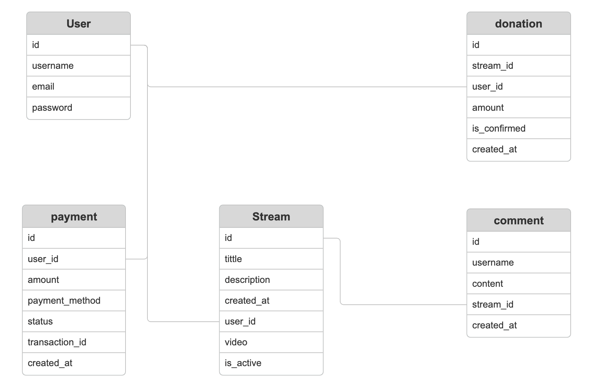

# live-streaming


## Tech Stack
```bash

* Backend: Django, Django Channels
* Frontend :HTML, CSS, JavaScript
* Database:  SQLite
* Payment Gateway : Midtrans
* Streaming Server:  Nginx-RTMP
* Message Broker: Redis
```


## 
```bash
Layers and Components:
1. Presentation Layer:
    * Components: HTML templates, CSS, JavaScript.
    * Responsibilities: Handle the user interface and presentation logic.
2. Application Layer:
    * Components: Django views, Django Channels, serializers.
    * Responsibilities: Handle business logic, real-time communication, and data processing.
3. Data Layer:
    * Components: Django models, database.
    * Responsibilities: Manage data persistence and retrieval.
4. Integration Layer:
    * Components: Payment gateway API (e.g., Midtrans), WebSocket for real-time updates.
    * Responsibilities: Handle external service integrations and real-time communication
```


## ERD
```bash

```


## Start Django
```bash
python manage.py runserver
```

## Start Celery
```bash
celery -A livestream worker --loglevel=info
```

