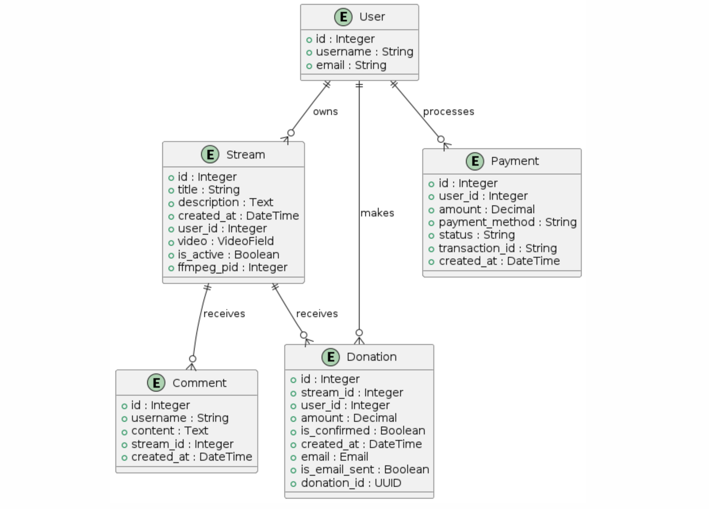
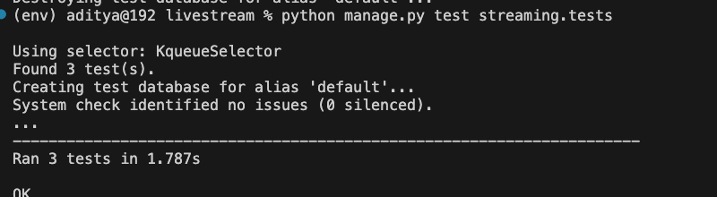
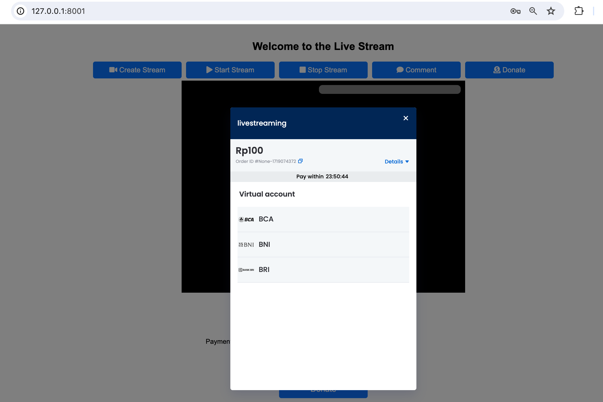
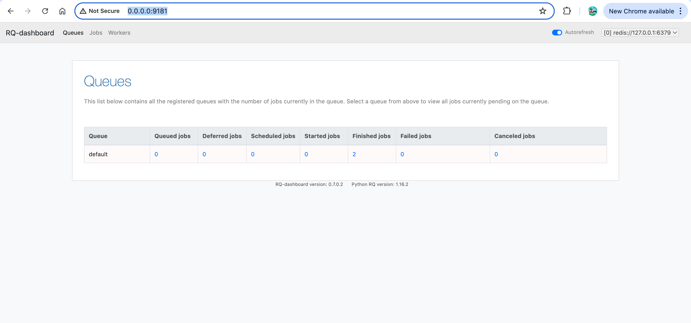
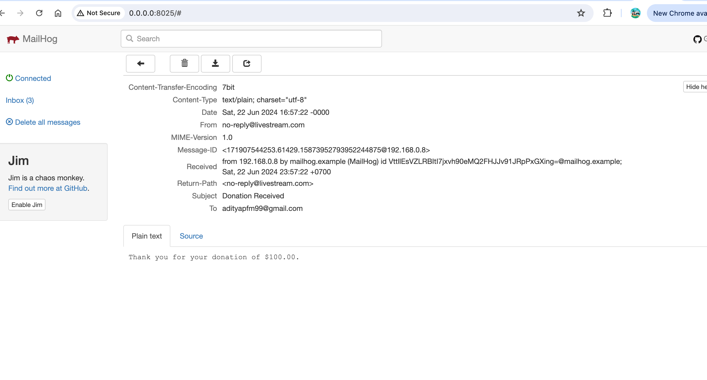

# live-streaming-test
```bash
A live streaming platform integrated with commenting and donation features using Midtrans sandbox. The key components include:
```
## System Design

```bash
    
    The system consists of:

    * Frontend: This consists of HTML, CSS, and JavaScript to create the user interface.
    * Backend: Built using Django, a high-level Python web framework.
    * WebSocket Server: Utilizes Django Channels to handle real-time WebSocket connections for live comments.
    * Payment Gateway Integration: Integrates Midtrans for processing donations.
    * Database: Uses SQLite for development 
```
## Technologies 
```bash

    * HTML/CSS: For structuring and styling the web pages.
    * JavaScript: For client-side scripting and WebSocket handling.
    * Django: As the backend framework for handling HTTP requests, user authentication, and database interactions.
    * Django Channels: For handling WebSocket connections for real-time features.
    * Midtrans: Third party For integrating the payment gateway 
    * SQLite: As the database for this case.
    * Video.js: For handling video playback in the browser.
    * OBS Studio: for video recording and live streaming.
    * Redis  : for sending Queue email notifications when donate payment
    * MailHog : is an Open Source email testing tool with a fake SMTP server underneath.
```
## Workflow : 
```bash
    * User Authentication: Users can register, log in, and log out. This is handled by Django built-in authentication system.
    * Stream Management: Authenticated users can create, start, and stop live streams.
    * Video Playback: Uses Video.js to play the live stream.
    * Real-time Comments: Implemented using WebSockets via Django Channels. Users can post comments in real-time, and these comments are  displayed on the video screen.
    * Donations: Users can make donations through a form. The form allows users to select a payment method  Virtual Account, or Credit Card The donation is processed using the Midtrans API.
```
## Detailed Workflow
```bash
    1. User Authentication
        Registration: Users fill out a registration form. The data is sent to the backend via a POST request to the /api/register/ endpoint. Upon successful registration, users are redirected to the login page.
        Login: Users provide their credentials. These are validated against the database, and if valid, an access token is issued, which is stored in the local storage.
        Logout: remove token and back to login page.
    2. Stream Management and OBS Studio
        Create Stream: Users click the "Create Stream" button, which triggers a POST request to the backend api/streams/create/  The backend creates a new stream record and returns the stream ID and other details.
        OBS Studio : After created stream, stream id will showing in message, and stream id must be register in OBS as a stream key, also server OBS is rtmp://127.0.0.1/live.
        Start Stream: When users click "Start Stream", a POST request is sent to /api/streams/{stream_id}/start/, which starts the stream session.
        Stop Stream: Clicking "Stop Stream" sends a POST request to /api/streams/{stream_id}/stop/, ending the stream session.
    3. Video Playback
       Video.js: The Video.js library is used to embed the video player in the HTML. The video source is set to the HLS stream URL.
    4. Real-time Comments
        WebSocket Connection: A WebSocket connection is established when the stream starts. Users can send messages via this connection.
        Display Comments: Comments are displayed in real-time within a comments section that overlays the video. The comments section has a semi-transparent background.
    5. Donations
        Donation Form: The donation form allows users to enter the amount and select a payment method.
        Process Payment: Upon form submission, a POST request is sent to the backend. If the selected method is virtual account / credit card, the backend generates a transaction token using the Midtrans API and returns it to the frontend. The Snap.js library is used to handle the payment process.
    6. Email notifications (mailhog)
        Send email to user who has success payment 
```


## ERD
```bash
```


## API DOCS (swagger)
```bash
http://127.0.0.1:8001/docs/

```


## Start Django
```bash
python manage.py runserver 8001
```

## Start Redis for email payment
```bash
python manage.py rqworker default
```
## Start stream


## OBS Setting
```bash
makesure stream keys is same with start stream message
```


## Unit Test

```bash
python manage.py test streaming.tests
```


## Real-time Comments


## Donation Midtrans Payment
```bash

```


## Dashboard RQ Queue (monitoring email notifications)
```bash
run : rq-dashboard

http://127.0.0.1:9181/
```


## Dashboard Midtrans
```bash
Midtrans Sandbox
```


## Dashboard Mailhog
```bash
http://0.0.0.0:8025/
```



